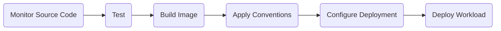
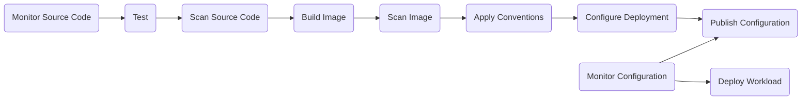

# Cartographer Supply Chains


[](https://slsa.dev/spec/v0.1/levels)
[](https://opensource.org/licenses/Apache-2.0)
[](https://twitter.com/kadrasIO)

A Carvel package providing [Cartographer](https://cartographer.sh) supply chains to build golden paths to production for applications and functions, from source code to deployment in a Kubernetes cluster.

## 🚀&nbsp; Getting Started

### Prerequisites

* Kubernetes 1.24+
* Carvel [`kctrl`](https://carvel.dev/kapp-controller/docs/latest/install/#installing-kapp-controller-cli-kctrl) CLI.
* Carvel [kapp-controller](https://carvel.dev/kapp-controller) deployed in your Kubernetes cluster. You can install it with Carvel [`kapp`](https://carvel.dev/kapp/docs/latest/install) (recommended choice) or `kubectl`.

  ```shell
  kapp deploy -a kapp-controller -y \
    -f https://github.com/carvel-dev/kapp-controller/releases/latest/download/release.yml
  ```

### Dependencies

Cartographer Supply Chains requires the [Cartographer Blueprints](https://github.com/kadras-io/cartographer-blueprints) package. You can install it from the [Kadras package repository](https://github.com/kadras-io/kadras-packages).

### Installation

Add the Kadras [package repository](https://github.com/kadras-io/kadras-packages) to your Kubernetes cluster:

  ```shell
  kubectl create namespace kadras-packages
  kctrl package repository add -r kadras-packages \
    --url ghcr.io/kadras-io/kadras-packages \
    -n kadras-packages
  ```

<details><summary>Installation without package repository</summary>
The recommended way of installing the Cartographer Supply Chains package is via the Kadras <a href="https://github.com/kadras-io/kadras-packages">package repository</a>. If you prefer not using the repository, you can add the package definition directly using <a href="https://carvel.dev/kapp/docs/latest/install"><code>kapp</code></a> or <code>kubectl</code>.

  ```shell
  kubectl create namespace kadras-packages
  kapp deploy -a cartographer-supply-chains-package -n kadras-packages -y \
    -f https://github.com/kadras-io/cartographer-supply-chains/releases/latest/download/metadata.yml \
    -f https://github.com/kadras-io/cartographer-supply-chains/releases/latest/download/package.yml
  ```
</details>

Install the Cartographer Supply Chains package:

  ```shell
  kctrl package install -i cartographer-supply-chains \
    -p cartographer-supply-chains.packages.kadras.io \
    -v ${VERSION} \
    -n kadras-packages
  ```

> **Note**
> You can find the `${VERSION}` value by retrieving the list of package versions available in the Kadras package repository installed on your cluster.
> 
>   ```shell
>   kctrl package available list -p cartographer-supply-chains.packages.kadras.io -n kadras-packages
>   ```

Verify the installed packages and their status:

  ```shell
  kctrl package installed list -n kadras-packages
  ```

## 📙&nbsp; Documentation

Documentation, tutorials and examples for this package are available in the [docs](docs) folder.
For documentation specific to Cartographer, check out [cartographer.sh](https://cartographer.sh).

This package provides a few out-of-the-box supply chains you can use as part of your golden paths to production.

### Supply Chain: Basic

The `basic` supply chain provides a simple Cartographer path consisting of the following stages:

* Monitor source code repository with FluxCD;
* Test source code with Tekton (when configured);
* Transform application source code into OCI images with kpack;
* Apply workload conventions (such as Spring Boot) with Cartographer Conventions;
* Define and configure the workload manifests with Knative;
* Deploy the workload using Carvel.



### Supply Chain: Advanced

The `advanced` supply chain provides a Cartographer path consisting of the following stages:

* Monitor source code repository with FluxCD;
* Test source code with Tekton;
* Scan source code with Grype;
* Transform application source code into OCI images with kpack;
* Scan image with Grype;
* Apply workload conventions (such as Spring Boot) with Cartographer Conventions;
* Define and configure the workload manifests with Knative and Carvel;
* Push the workload manifests via GitOps or RegistryOps;
* Generate the deliverable resource used for deployment on Kubernetes.



## 🎯&nbsp; Configuration

The Cartographer Supply Chains package can be customized via a `values.yml` file.

  ```yaml
  registry:
    server: ghcr.io
    repository: thomasvitale/carto
  ```

Reference the `values.yml` file from the `kctrl` command when installing or upgrading the package.

  ```shell
  kctrl package install -i cartographer-supply-chains \
    -p cartographer-supply-chains.packages.kadras.io \
    -v ${VERSION} \
    -n kadras-packages \
    --values-file values.yml
  ```

### Values

The Cartographer Supply Chains package has the following configurable properties.

<details><summary>Configurable properties</summary>

| Config | Default | Description |
|-------|-------------------|-------------|
| `supply_chain` | `basic` | The type of supply chain to deploy. Options: `basic`, `advanced`. |
| `service_account` | `default` | The default `ServiceAccount` used by the supply chain. |
| `cluster_builder` | `default` | The default `ClusterBuilder` used by kpack. |
| `git_access_secret` | `git-secret` | The Secret containing authentication credentials for the Git repository. |
| `registry.server` | `""` | The server of the OCI Registry where the supply chain will publish and consume OCI images. **Required**. |
| `registry.repository` | `""` | The repository in the OCI Registry where the supply chain will publish and consume OCI images. **Required**. |
| `registry.ca_cert_data` | `""` | PEM-encoded certificate data for the OCI Registry where the supply chain will publish and consume OCI images. |

Settings for using a GitOps strategy with the supply chain.

| Config | Default | Description |
|-------|-------------------|-------------|
| `gitops.strategy` | `none` | Whether to commit configuration changes to Git directly (`direct`) or via a pull request (`pull_request`). If `none`, no GitOps strategy is applied. |
| `gitops.user.name` | `cartographer` | The name of the user interacting with the Git repository. |
| `gitops.user.email` | `cartographer@kadras.io` | The email of the user interacting with the Git repository. |
| `gitops.commit.message` | `Update from Cartographer` | The commit message to use when pushing configuration changes to Git. |
| `gitops.server_address` | `https://github.com` | The location of the server hosting the specified Git repository. |
| `gitops.target_branch` | `main` | The target branch where to push configuration changes. |
| `gitops.repository.owner` | `""` | The owner of the Git repository. |
| `gitops.repository.name` | `""` | The name of the Git repository. |
| `gitops.pull_request.server_kind` | `github` | The type of Git server where to open the pull request. |
| `gitops.pull_request.commit_branch` | `""` | The branch to use to open a pull request. If empty, a random name is generated. |
| `gitops.pull_request.title` | `Update from Cartographer` | The title of the pull request. |
| `gitops.pull_request.body` | `Generated from Cartographer` | The message body of the pull request. |

</details>

## 🛡️&nbsp; Security

The security process for reporting vulnerabilities is described in [SECURITY.md](SECURITY.md).

## 🖊️&nbsp; License

This project is licensed under the **Apache License 2.0**. See [LICENSE](LICENSE) for more information.

## 🙏&nbsp; Acknowledgments

This package is inspired by:

* the [examples](https://github.com/vmware-tanzu/cartographer/tree/main/examples) in the Cartographer project;
* the original cartographer-catalog package used in [Tanzu Community Edition](https://github.com/vmware-tanzu/community-edition) before its retirement;
* the [set of supply chains](https://github.com/vrabbi/tap-oss/tree/main/packages/ootb-supply-chains) included in an example of Tanzu Application Platform OSS stack.
* the [set of supply chains](https://github.com/LittleBaiBai/tap-playground/tree/main/supply-chains) included in the playground for Tanzu Application Platform.
