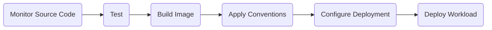
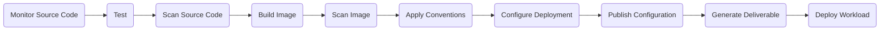

# Supply Chains

This package provides a few supply chains you can use as part of your golden paths to production.

### Supply Chain (Basic): Source-to-URL

The `source-to-url-basic` supply chain provides a simple path consisting of the following stages:

* Monitor source code repository with FluxCD;
* Test source code with Tekton (when configured);
* Transform application source code into OCI images with kpack;
* Apply workload conventions (such as Spring Boot) with Cartographer Conventions;
* Define and configure the workload manifests with Knative;
* Deploy the workload using Carvel.

### Supply Chain (Advanced): Source-to-URL

The `source-to-url-advanced` supply chain provides a path consisting of the following stages:

* Monitor source code repository with FluxCD;
* Test source code with Tekton;
* Scan source code with Trivy;
* Transform application source code into OCI images with kpack;
* Scan image with Trivy;
* Apply workload conventions (such as Spring Boot) with Cartographer Conventions;
* Define and configure the workload manifests with Knative and Carvel;
* Push the workload manifests via GitOps or RegistryOps;
* Generate the deliverable resource used for deployment on Kubernetes (Carvel or Flux);
* Deploy the workload using Carvel (optional, if not external delivery).

This supply chain can be used in a single cluster setup and take care of the application deployment, or in a multicluster setup and generate the deliverable manifest that can be manually applied to a different cluster to deploy the application via GitOps/RegistryOps.
